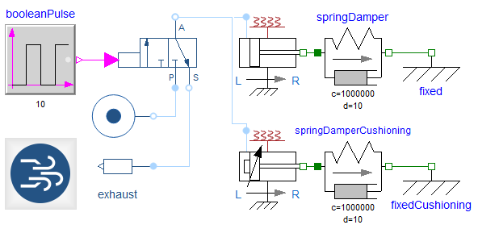
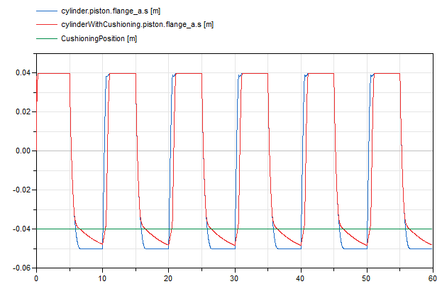

The new Pneumatic Systems Library (PSL) is intended to assist the development of pneumatic systems. PSL enables predicting the system behavior for a wide range of industrial applications such as industrial machines, pneumatic brakes or suspension systems
as well as cooling and engine bleed air systems for aerospace.

In this first release, the following components are introduced:
- Gases: IdealAir model and ImportFromMSL so any media model extending from Modelica.Media.Interfaces.PartialMedium can be used for gas properties.
- Sources: ideal pressure, mass flow rate and exhaust, silencer and a vane compressor.
- Valves: directional, proportional and flow control valves.
- Actuators: linear, rotary and bellow drive.
- Reservoirs.
- Piping: tube, bend and a custom pressure loss component.
- Sensors.

The library also includes a package modeling the main physical effects modeled: capacitance (energy storage), resistance (energy dissipation) and power transformation (mechanical and thermal). These effects serve as a basis for the development of the previously listed components.

The component icons are compliant with the standard ISO 1219 which is typically used for pneumatic schematics. Animation is provided to see the valve and cylinder displacement with respect to their command.

As an example, the following model represents two single-acting cylinders with spring feedback, piloted by a single directional control valve alternatively connecting to an ideal pressure source or exhaust. While the top cylinder does not include any cushioning device, the piston of the bottom cylinder will close the inlet port when it approaches its end stop (throttle effect).

{:width="1000px"}

This example covers the main physical effects involved into pneumatics: capacitance as the gas volume inside the cylinder, restriction as the inlet flow restriction into the cylinder and transformation as the cylinder converts pneumatic into mechanic power.

As the example uses a one-sided cylinder, cushioning only happens on the left side of the cylinder actuation. When the piston enters in the cushioning zone (below the green line), the cylinder with cushioning (red plot) receives less mass flow rate from the inlet port and thus its speed decreases regarding the top cylinder (blue plot).

{:width="1000px"}
